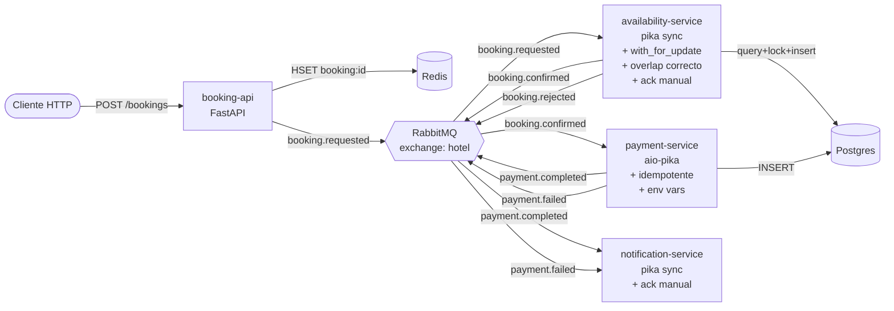

# Arquitectura objetivo

Este es el estado al que debes llegar. Los 4 servicios funcionando, mensajería bien configurada, idempotencia donde aplique, y race conditions resueltas.

## Eventos del sistema final

| Routing key | Publicado por | Consumido por |
|---|---|---|
| `booking.requested` | booking-api | availability-service |
| `booking.confirmed` | availability-service | payment-service |
| `booking.rejected` | availability-service | (notification-service opcional) |
| `payment.completed` | payment-service | notification-service |
| `payment.failed` | payment-service | notification-service |

## Bonus (Tier 3): saga compensatoria

Si implementas la saga, agrega también:

- `booking.cancelled` publicado por payment-service cuando el cobro falla
- availability-service consume `booking.cancelled` y libera la habitación
